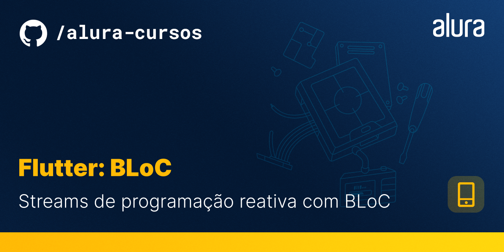
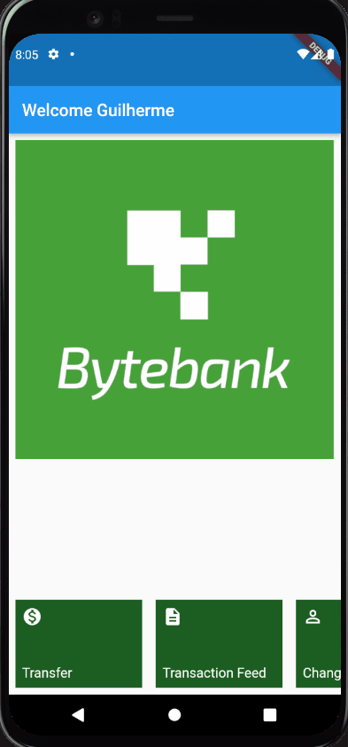

# Bytebank

O Bytebank App é a simulação do aplicativo de um banco. Com ele, você poderá fazer transações bancárias, informando o número da conta e o valor monetário da transação!

Esse repositório é uma continuação das funcionalidades criadas no projeto [Bytebank - Gerenciamento de Estados com Provider](https://github.com/alura-cursos/flutter-gerenciamento-de-estado).

## 🔨 Características do projeto

Neste projeto, você será capaz de usar o [**Gerenciador de Estados BLoC**](https://bloclibrary.dev/#/gettingstarted) para tornar o desenvolvimento da sua aplicação mais eficiente e escalável.

## ✔️ Técnicas e tecnologias

**Para desenvolver o projeto, utilizamos as seguintes técnicas e tecnologias:**

- `BLoCs e Cubits`
- `Gerenciamento de Estado com BLoC`
- `Framework de Gerenciamento de Estado`
- `Separação da UI, Estado e Eventos`

## 📁 Acesso ao projeto

Cada branch separa uma etapa do desenvolvimento do projeto, estando divididas da seguinte forma:

- [**aula-1**](https://github.com/alura-cursos/flutter-bloc/tree/aula1) - Uso do BLoC e do Flutter BLoC
- [**aula-2**](https://github.com/alura-cursos/flutter-bloc/tree/aula2) - Integração do Fluxo de Telas
- [**aula-3**](https://github.com/alura-cursos/flutter-bloc/tree/aula3) - Criando um Framework
- [**aula-4**](https://github.com/alura-cursos/flutter-bloc/tree/aula4) - Uso do BLoC para criação de formulários

Você pode [baixar o zip](https://github.com/alura-cursos/flutter-bloc/archive/aula4.zip) com o código final do projeto ou [acessar o código fonte](https://github.com/alura-cursos/flutter-bloc/tree/aula4).

## 🛠️ Abrir e rodar o projeto

**Para executar este projeto, você precisa de:**

- Ter o [Flutter](https://flutter.dev/docs/get-started/install) instalado na sua máquina
- Ter algum editor de códigos ou IDE como o [Android Studio](https://developer.android.com/studio) ou [Intellij Idea](https://www.jetbrains.com/pt-br/idea/download/).

Caso opte por IDEs como as duas sugeridas acima, o processo de execução do aplicativo funcionará através de um botão de play na parte superior que ambas dispõem. Caso escolha rodar o projeto via linha de comandos, utilize o comando `flutter run`. Lembre-se de antes de executar o comando de navegar até a pasta do projeto antes.

Para mais instruções sobre a configuração do ambiente, recomendamos a leitura do artigo [Flutter - Como configurar o ambiente de desenvolvimento](https://www.alura.com.br/artigos/flutter-como-configurar-o-ambiente-de-desenvolvimento). Caso tenha desejo de obter conhecimento além dos cursos da [Formação Flutter](https://www.alura.com.br/formacao-flutter), recomendamos os livros [Iniciando com Flutter Framework](https://www.casadocodigo.com.br/products/livro-flutter) e [Aprofundando em Flutter](https://www.casadocodigo.com.br/products/livro-aprofundando-flutter) da editora [Casa do código](https://www.casadocodigo.com.br/).

## 📚 Mais informações do curso

Gostou do projeto e quer conhecer mais? Você pode acessar o curso [Flutter: Streams de programação reativa com BLoC](https://cursos.alura.com.br/course/flutter-bloc) que desenvolve o projeto desde o começo!

Esse curso faz parte da [formação de Flutter da Alura](https://cursos.alura.com.br/formacao-flutter)
